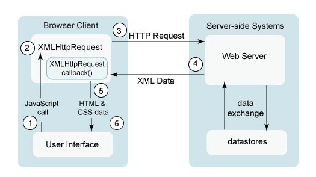

# Laborator 12 - [JS] - AJAX 

AJAX este prescurtarea pentru Asynchronous JavaScript and XML (JavaScript si XML asincron) si reprezinta o colectie de tehnologii utilizate in dezvoltarea aplicatiilor web. AJAX presupune un schimb redus de date intre browser si server, astfel incat sa nu mai fie necesara reincarcarea intregii pagini web de fiecare data cand utilizatorul face o schimbare in continutul sau.



## Exercitiul 12.1

### My server

* Instalati [JSON Server](https://github.com/typicode/json-server) folosind comanda de mai jos:

```bash
npm install -g json-server
```

* Creati un fisier `db.json` cu continutul de mai jos:

```json
{
  "dogs": [
    { "id": 1, "name": "AFFENPINSCHER", "img": "https:\/\/dog.ceo\/api\/img\/affenpinscher\/n02110627_11584.jpg" },
    { "id": 2, "name": "AKITA", "img": "https:\/\/dog.ceo\/api\/img\/akita\/Akita_Inu_dog.jpg" },
    { "id": 3, "name": "CHIHUAHUA", "img": "https:\/\/dog.ceo\/api\/img\/chihuahua\/n02085620_8578.jpg" },
    { "id": 4, "name": "LHASA", "img": "https://dog.ceo//api//img//lhasa//n02098413_3033.jpg" },
    { "id": 5, "name": "MINIATURE SCHNAUZER", "img": "https://dog.ceo//api//img//schnauzer//n02097209_920.jpg" }
  ]
}
```

* Porniti JSON Server folosind comanda de mai jos:

```bash
json-server --watch db.json
```

* Accesand link-ul [http://localhost:3000/dogs/1](http://localhost:3000/dogs/1), veti vedea:

```json
{ "id": 1, "title": "json-server", "author": "typicode" }
```

## Exercitiul 12.2

### Dogs

* Creati un document HTML `index.html`.
* Creati un fisier JavaScript `script.js` si legati-l de documentul HTML folosind `<script>` la sfarsitul acestuia.
* Aduceti de la server lista de entitati *dog* folosind [fetch](https://developers.google.com/web/updates/2015/03/introduction-to-fetch) - actiune de tip [GET](https://spring.io/understanding/REST#get).
* Afisati lista de entitati in pagina.
